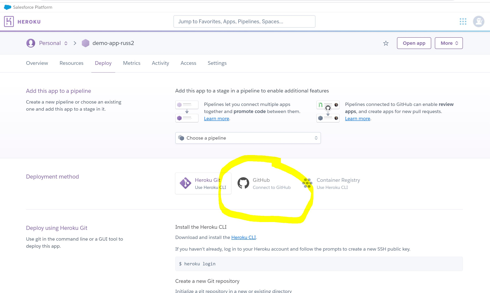
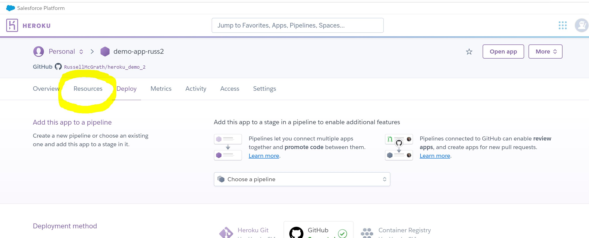
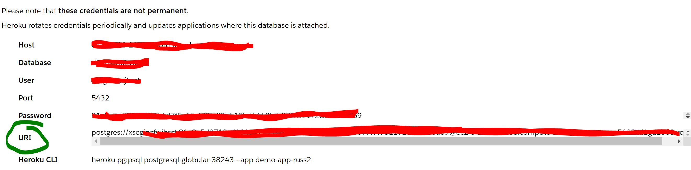

## Heroku Deployment

### Prerequisites

* Sign up for a [Heroku](https://www.heroku.com) account.

* Install the [Heroku CLI tool](https://devcenter.heroku.com/articles/heroku-cli#download-and-install).

### Deploying an application

* This process consists of:

  1. Creating a repo for the application.
  2. Preparing the application with additional configuration files (`Procfile` and `requirements.txt`)
  3. Creating the Heroku application
  4. Preparing the Heroku database

#### Part 1: Create application and push to GitHub Repo


#### Part 2: Configuration Files

* Start by creating a new conda environment just for this app. All of our project dependencies will be installed in this environment. **Note:** This should only contain python 3.6 and not anaconda.

```sh
conda create -n pet_pals_env python=3.6
```

* Make sure to activate this new environment before proceeding.

```sh
conda activate example_env
```

* **Note** if you run into issues try the following command instead.

```sh
source activate example_env
```

* Next, we install `gunicorn` with `pip install gunicorn`. Explain that gunicorn is a high performance web server that can run their Flask app in a production environment.

* Because this app will use Postgres, we also install `psycopg2` with `pip install psycopg2`.

* Install the remaining libraries into your new environment.

```sh
pip install flask
pip install flask-sqlalchemy
pip install pandas
```

* If it doesn't already exist, navigate to the root dir and create initdb.py. This will be used to initialize the database.

```sh
touch initdb.py
```

* Add the following code to the initdb.py file:

```sh
from app import db

db.create_all()
```

* Navigate to the folder that contains `initdb.py` and run the following to initialize the database.

```sh
python initdb.py
```

* Create a shell file

```sh
touch run.sh
```

* ...and add the following code:

```sh
FLASK_APP=app.py flask run
```

* You can test the application by running the following in your command line.

```sh
./run.sh
```

* Navigate to `127.0.0.1:5000` to view your webpage.

* Now that all of the the project dependencies are installed, we need to generate the `requirements.txt` file. This file is a list of the Python packages required to run the app. Heroku will use this file to install all of the app's dependencies.

```sh
pip freeze > requirements.txt
```

* The final configuration file that we need is `Procfile`. This file is used by Heroku to run the app.

```sh
touch Procfile
```

* Add the following code to the `Procfile` which instructs Heroku how to run the app.
  
```sh  
web: gunicorn pet_pals.app:app
```

* `pet_pals` is the name of the folder that contains your app as a python package (i.e. the name of the folder with the `__init__.py` file in it).

* Add, commit and push everything up to your repo.

#### Part 3: Creating the Heroku App

* Navigate to [Heroku](https://www.heroku.com) and create an account.

* Once you are at the main dash click New in the type right and select **Create a new app**.

  * Give your app an unique name and leave region to default.

* On Heroku, go to the `Deploy` section of your app's homepage, and follow the steps to deploy the app.


  * In the Deployment Method section select **GitHub**.

  

  * Follow the steps to link Heroku with your GitHub account

  * Once connected search for the repo you created that contains your code from the previous step, and connect.

  * With your repo selected, navigate to the **Manual deploy** section below it and click **Deploy Branch**.

  * Heroku will install the necessary libraries. This may take a few minutes.

  * To confirm your app has been successfully deployed navigate to the top of the page and click **Open app**. This should open a webpage with you pet pals web page. **Note** the database has not been set up yet, so there is one more step before it is fully functioning.

#### Part 4: Preparing the Database

* After creating a new app on Heroku, navigate to `Resources`:

  

  * Under `Add-ons`, search `Heroku Postgres`. Make sure to use the free version then click `Submit Order Form`.

  

* Once `Heroku Postgres` is listed on click on it.

* From the new page, navigate to `Settings` and click on `View Credentials`.

* The connection string to the database should now be available in the **URI** field:

  

* Heroku will automatically assign this URI string to the `DATABASE_URL` environment variable that is used within `app.py`. The code that is already in `app.py` will be able to use that environment variable to connect to the Heroku database.

  ```python
  # DATABASE_URL will contain the database connection string:
  app.config['SQLALCHEMY_DATABASE_URI'] = os.environ.get('DATABASE_URL', '')
  # Connects to the database using the app config
  db = SQLAlchemy(app)
  ```

* The final step requires the Heroku CLI. If you do not currently have it installed please follow the instructions for the [Heroku CLI](https://devcenter.heroku.com/articles/heroku-cli).

* After adding the database, the final step is to initialize the database. To do this, we use the heroku cli. From the terminal, type the following, be sure to replace `<name of your app>` with the name of your app as it appear in heroku:

```sh
heroku run python initdb.py -a <name of your app>
```

* Your database is now initialized, and you can open the application using `heroku open` from the terminal or from **Open App** on the webpage.
